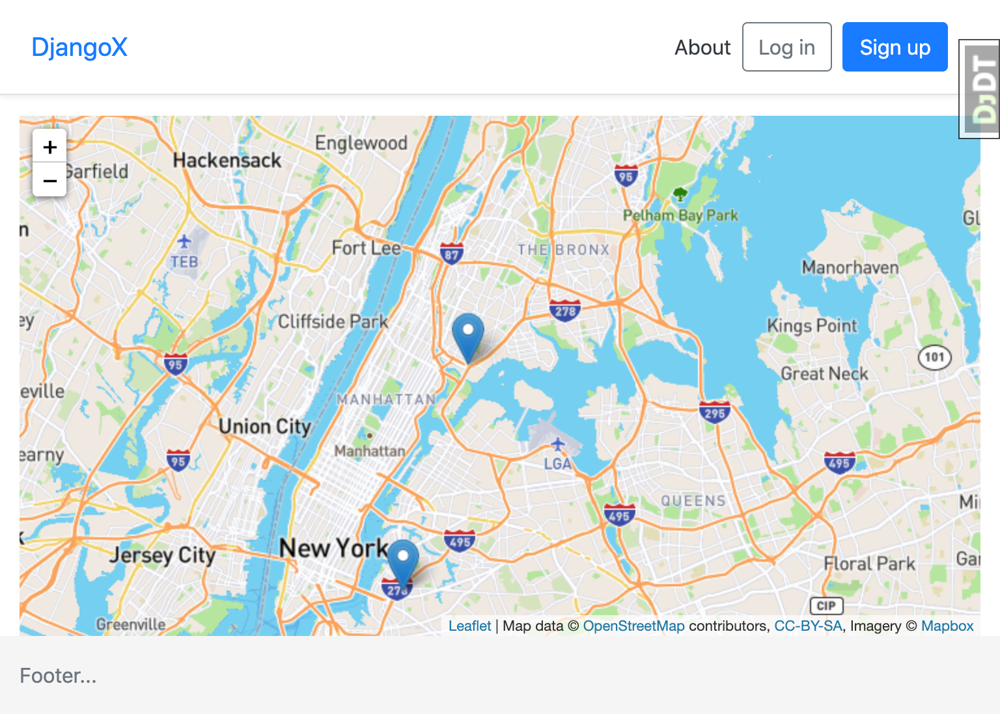

> A Django example displaying a leaflet map with items from the database.

For more info on djangox see their page https://github.com/wsvincent/djangox

## 📖 Install

```
$ git clone https://github.com/wsvincent/djangox.git
$ cd djangox
$ pipenv install
$ pipenv shell

# Run Migrations
(djangox) $ python manage.py migrate

# Create a Superuser:
(djangox) $ python manage.py createsuperuser

# Confirm everything is working:
(djangox) $ python manage.py runserver

# Load the site at http://127.0.0.1:8000
```



<!-- ## Docker Usage
```
# Build the Docker Image
$ docker-compose build

# Run Migrations
$ docker-compose run --rm web python manage.py migrate

# Create a Superuser
$ docker-compose run --rm web python manage.py createsuperuser

# Run Django on http://localhost:8000/
$ docker-compose up

# Run Django in background mode
$ docker-compose up -d

# Stop all running containers
$ docker-compose down

# Run Tests
$ docker-compose run --rm web pytest

# Re-build PIP requirements
$ docker-compose run --rm web pip-compile requirements/requirements.in
```-->
